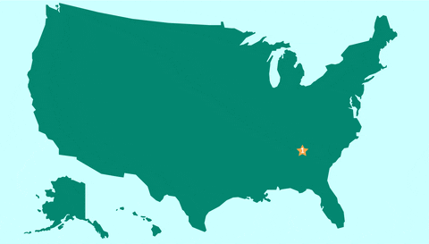
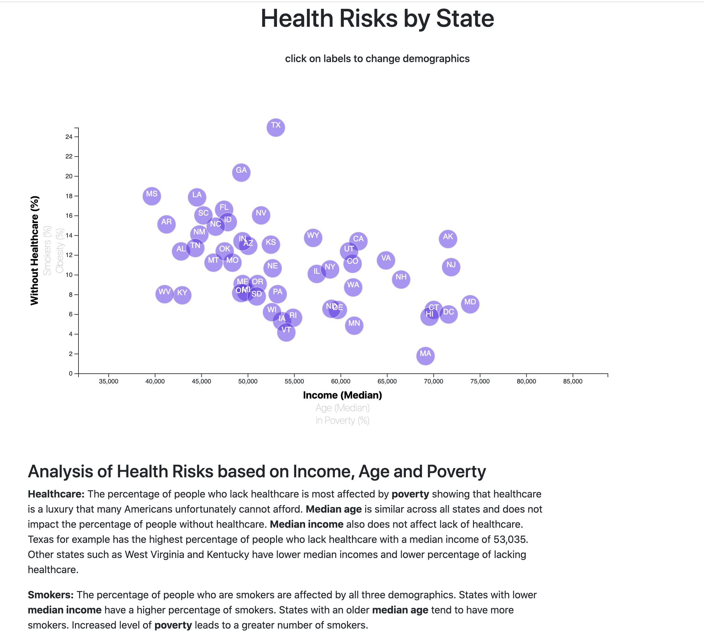
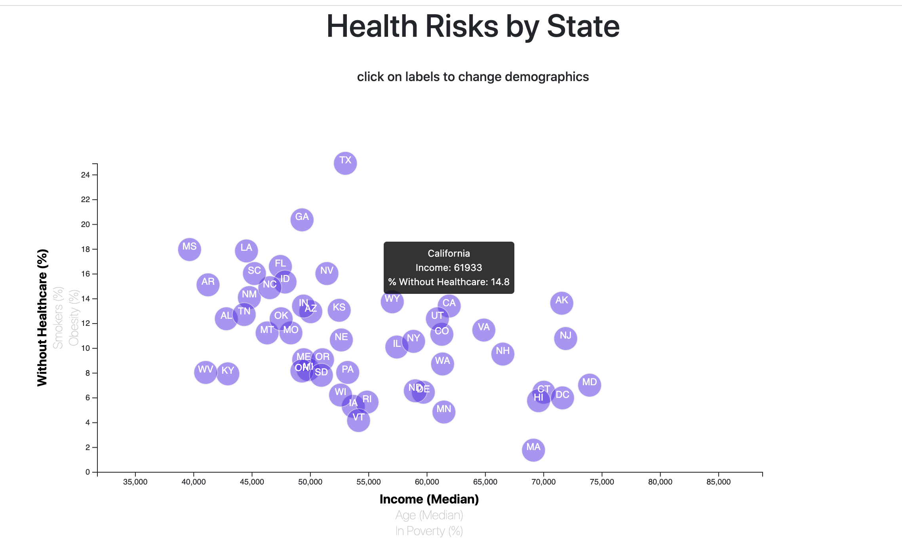

# D3_data_journalism

Created by [Celeste Muniz - Lithgow](https://github.com/celeste1030)

 

## Table of Contents
* [Objective](#objective)
* [How to View](#how-to-view)
* [Steps](#steps)
* [Technologies](#technologies)

## Objective

In this assignment, I analyzed the trends shaping people's lives, as well as created graphs with interactive elements to help readers understand my findings.

## How to View

1. Download repo to your local drive.
2. Open in VS code.
3. Open index.html with Live Server.

## Steps

### Step 1

1. More Data, More Dynamics

Including more demographics and more risk factors, I placed additional labels in your scatter plot and give them click events so users can decide which data to display. There are 3 labels per axis. I animated the transitions for the circles' locations as well as the range of axes.

 

2. Incorporate d3-tip

I added d3 tool-tips to my plot to reveal a specific element's data when the user hovers their cursor over the element. The data displayed includes full name of State, info from selected x axis and info from selected y axis.

 

## Technologies

D3

Java

Html

CSS

